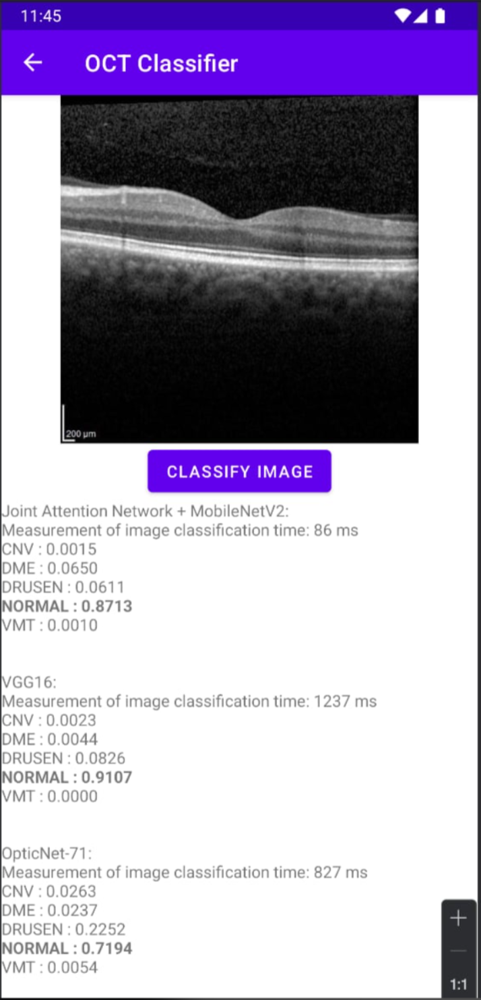

# Classification of OCT images of the human eye using mobile devices

The Android application designed for the classification of OCT images was developed using the Kotlin programming language within the Android Studio integrated development environment. With the application, classification can be performed on an image chosen from the user’s files or an image acquired using the photo-taking function. The results of the classification are displayed for three neural networks, along with the respective classification times for each neural network and the associated image undergoing the classification task.

**Authors:** Nina Budna, Róża Chwałek and Marcin Dziedzic
**Supervision:** Agnieszka Stankiewicz, Tomasz Marciniak

# How to use
To run the application source code, download and install the Android Studio software available for free at https://developer.android.com/studio. After installation, select the "Open" option and indicate the path to the unpacked folder with the application source code.
After opening the project, it is necessary to synchronize the files with the Ctrl+Shift+O shortcut, during which all the necessary libraries will be downloaded. At this point, the application is ready to be launched on a mobile device, for this purpose you can use wireless debugging, or connect the phone to the computer in USB debugging mode. 

# Citation
Stankiewicz, A.; Marciniak, T.; Budna, N., Chwalek, R., Dziedzic, M. Classification of OCT images of the human eye using mobile devices. Appl. Sci. 2024, 1, 0. https://doi.org/
